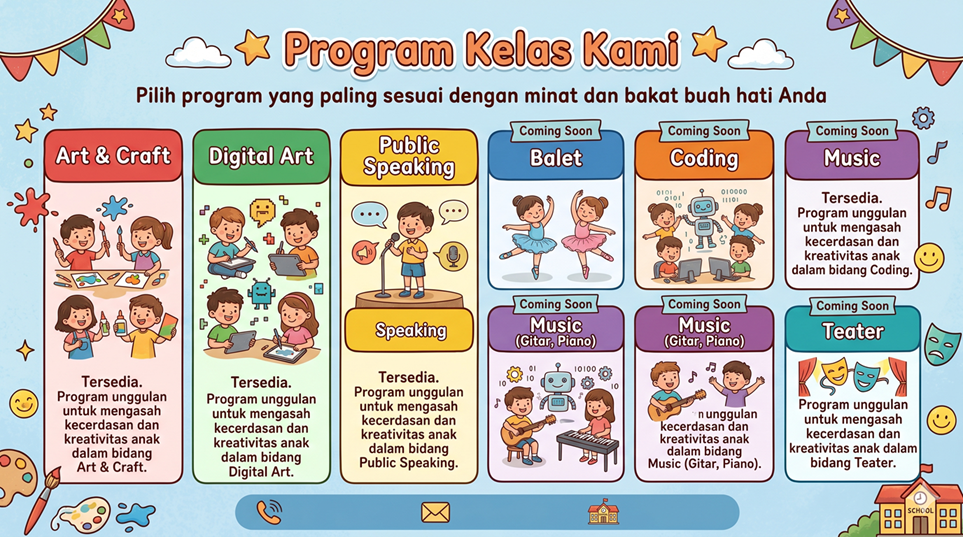

<div align="center">
  
  <h1>🚀 SIMBIM </h1>
  <p><strong>Sistem Pendukung Keputusan Pemilihan Bimbingan Belajar Anak</strong></p>
  <br>
  [!PHP Version](https://www.php.net/)
  [!MySQL](https://www.mysql.com/)
  [!Bootstrap](https://getbootstrap.com/)
  [!License](LICENSE)
</div>

---

### 📝 Deskripsi Proyek
**SIMBIM** adalah platform cerdas yang dirancang untuk membantu orang tua memilih kelas bimbingan belajar (bimbel) yang paling sesuai dengan potensi anak. Berbeda dengan sistem konvensional, SIMBIM menggunakan pendekatan psikologis berbasis minat dan bakat, bukan sekadar nilai akademik sekolah.

Dengan mengimplementasikan metode **Weighted Product (WP)**, sistem memberikan rekomendasi yang objektif, terpersonalisasi, dan dapat dipertanggungjawabkan secara ilmiah untuk mendukung pengambilan keputusan orang tua.

---

### ✨ Fitur Unggulan

#### 👨‍👩‍👧‍👦 Untuk Orang Tua
*   **Smart Assessment:** Kuesioner interaktif dengan *Progress Bar* dan validasi instan.
*   **Manajemen Profil Anak:** Kelola data beberapa anak dalam satu akun, memudahkan asesmen berulang.
*   **Visualized Results:** Pemetaan bakat menggunakan **Radar Chart** dan kesimpulan deskriptif otomatis di halaman hasil.
*   **Progress Tracking:** Pantau perkembangan potensi anak dari waktu ke waktu melalui **Line Chart** di dasbor dan halaman profil anak.
*   **Professional Reports:** Unduh laporan hasil asesmen lengkap dalam format **PDF** yang rapi.

#### 🛠️ Untuk Administrator
*   **Analytics Dashboard:** Pantau tren pendaftaran, distribusi minat, statistik bulanan, dan **Top 5 Kelas** melalui 3 grafik dinamis.
*   **Algorithm Tuning:** Kalibrasi matriks WP secara masal melalui antarmuka *Grid Matrix*.
*   **Site Management:** Kendali penuh atas identitas visual (Logo, Favicon), pengumuman global, mode pemeliharaan, dan status pendaftaran.
*   **Data Security:** Sistem *Soft Delete* dengan panel Restore, pencatatan *Audit Trail*, dan backup database otomatis.
*   **Excel Export:** 🆕 Unduh rekap laporan asesmen berdasarkan rentang tanggal ke format **Excel**.

#### 📋 Untuk Staf (Hak Akses Terbatas) — 🆕
*   **Manajemen Follow-Up (Mini-CRM):** Ubah status tindak lanjut (`Belum Dihubungi`, `Sudah Dihubungi`, `Mendaftar`) dan tambahkan catatan untuk setiap hasil asesmen.
*   **Dukungan Pengguna:** Reset password orang tua, cetak kartu pendaftaran fisik (PDF), dan isi asesmen atas nama mereka.
*   **Utilitas Data:** Deteksi dan bersihkan **akun duplikat** serta pantau **aktivitas login** terakhir pengguna.
*   **Integrasi Cepat:** Tombol "Hubungi WA" untuk follow-up yang lebih cepat dan efisien.

---

### 🧮 Metodologi SPK: Weighted Product

Sistem ini menggunakan teknik perkalian untuk menghubungkan rating kriteria. Setiap rating dipangkatkan dengan bobot kriteria yang bersangkutan.

1.  **Normalisasi Bobot ($w_j$):** 
    Menghitung kepentingan relatif kriteria berdasarkan input orang tua.
    $$\textstyle w_j = \frac{W_j}{\sum W_k}$$

2.  **Vektor S ($S_i$):** 
    Menghitung preferensi alternatif (Kelas) terhadap kriteria.
    $$\textstyle S_i = \prod (X_{ij})^{w_j}$$

3.  **Vektor V ($V_i$):** 
    Normalisasi Vektor S untuk mendapatkan peringkat akhir.
    $$\textstyle V_i = \frac{S_i}{\sum S_k}$$

---

### 🛠️ Teknologi yang Digunakan

| Komponen | Teknologi |
| :--- | :--- |
| **Core Engine** | PHP 8.5 Native |
| **Database** | MySQL |
| **Frontend Framework** | Bootstrap 5.3 + Bootstrap Icons |
| **Data Visualization** | Chart.js |
| **Document Processor** | Dompdf |
| **Font Engine** | Google Fonts (Poppins) |

---

### 📂 Struktur Proyek

```
SimBim/
├── config/
│   └── koneksi.php            # Konfigurasi koneksi database
├── database/
│   ├── simbim.sql             # Schema & data awal database
│   └── migrate2.php           # Skrip migrasi: aktifkan role staf
├── includes/
│   ├── header.php             # Template navbar & head (shared)
│   ├── footer.php             # Template footer (shared)
│   ├── get_matriks.php        # API AJAX: ambil data matriks kelas
│   └── proses_simpan.php      # Handler: simpan hasil asesmen
├── assets/
│   ├── style.css              # Stylesheet kustom
│   ├── dompdf/                # Library PDF generator
│   ├── img/                   # Gambar & banner
├── index.php                  # Landing page publik
├── login.php                  # Halaman login
├── daftar.php                 # Registrasi akun orang tua
├── logout.php                 # Handler logout
├── maintenance.php            # Halaman mode pemeliharaan
├── asesmen.php                # Form kuesioner asesmen anak
├── profil_anak.php            # Halaman detail riwayat per anak
├── dashboard.php              # Dashboard orang tua
├── staff_dashboard.php        # Dashboard staf (read-only)
├── admin_dashboard.php        # Panel admin (full access)
├── hasil.php                  # Halaman hasil (setelah asesmen)
├── hitung_wp.php              # Halaman hasil (untuk riwayat)
├── cetak_pdf.php              # Generate laporan PDF
├── cetak_kartu.php            # Generate kartu pendaftaran (PDF)
├── export_db.php              # Backup database (SQL dump)
├── export_excel.php           # Generate laporan Excel
└── README.md
```

---

### 🚀 Instalasi & Setup Cepat

1.  **Clone & Masuk ke Direktori:**
    ```bash
    git clone https://github.com/BotHunting/SimBim.git
    cd SimBim
    ```
2.  **Persiapan Database:**
    *   Buat database `simbim` di phpMyAdmin.
    *   Import file `database/simbim.sql`.
3.  **Konfigurasi Koneksi:**
    Sesuaikan `$host`, `$user`, `$pass`, dan `$db` pada file `config/koneksi.php`.
4.  **Jalankan:**
    Pindahkan ke folder `htdocs` dan akses `http://localhost/SimBim`.
5.  **Aktifkan Role Staf (Opsional):**
    Buka `http://localhost/SimBim/database/migrate2.php` di browser, lalu hapus file setelah selesai.

---

### 🔑 Akun Demo

Anda dapat menggunakan akun berikut untuk login dan mencoba fitur sesuai dengan level hak aksesnya.

| Role        | Username    | Password |
| :---------- | :---------- | :------- |
| **Admin**   | `admin`     | `admin123` |
| **Staf**    | `staf_demo` | `staf123`  |
| **Orang Tua** | `user`      | `user123`  |
| **Orang Tua** | `user2`     | `user123`  |

---

###  Log Perubahan (Changelog)

#### ✨ Versi 1.6 (Peningkatan UI/UX) — Pembaruan Terkini
*   **Modern Loading Experience:** Mengganti *spinner* klasik dengan efek *Skeleton Loading* yang lebih modern saat memuat data matriks di panel admin.
*   **Konsistensi Desain Form:** Merombak desain form input (`login`, `daftar`) menjadi gaya "boxy" yang lebih bersih dan konsisten, meninggalkan gaya *underline*.
*   **Hierarki Aksi yang Jelas:** Menetapkan satu tombol aksi utama (`btn-primary`) per halaman/konteks (misal: "Mulai Asesmen", "Cetak Laporan") untuk memandu alur pengguna dengan lebih efektif.
*   **Teks Aksi yang Lebih Baik:** Memperjelas teks pada tombol-tombol di seluruh aplikasi agar lebih ringkas dan mudah dipahami.
*   **Pengalaman Personal:** Pesan selamat datang di dasbor orang tua kini menyapa nama depan pengguna untuk sentuhan yang lebih personal.
*   **Dokumentasi Dinamis:** Menambahkan fitur bagi Admin untuk mencetak Dokumen Persyaratan Produk (PRD) terbaru langsung dari dashboard.

#### 🚀 Versi 1.5 (Transformasi Peran Staf)
*   **Transformasi Role Staf (Tata Usaha):**
    *   **Manajemen Follow-Up (Mini CRM):** Staf kini dapat mengubah status tindak lanjut (`Belum Dihubungi`, `Sudah Dihubungi`, `Mendaftar`) dan menambahkan catatan untuk setiap hasil asesmen.
    *   **Integrasi WhatsApp:** Tombol "Hubungi WA" ditambahkan di laporan dan monitor aktivitas untuk follow-up yang lebih cepat.
    *   **Manajemen Pengguna oleh Staf:** Staf dapat mereset password orang tua dan mencetak kartu pendaftaran fisik dalam format PDF.
*   **Fitur Utilitas & Kebersihan Data:**
    *   **Deteksi Akun Duplikat:** Fitur cerdas untuk mendeteksi dan membersihkan akun orang tua yang terdaftar ganda berdasarkan nama lengkap.
    *   **Monitor Aktivitas Login:** Panel baru untuk memantau 20 aktivitas login terakhir dari orang tua, membantu staf mengetahui pengguna aktif.
*   **Peningkatan Fungsionalitas Asesmen:**
    *   **Asesmen oleh Staf/Admin:** Staf dan Admin kini dapat mengakses dan mengisi form asesmen atas nama orang tua manapun, sangat berguna untuk demo atau bantuan langsung.
    *   **Auto-Fill Eksklusif:** Fitur "Demo Auto-Fill" kini hanya tersedia untuk Staf dan Admin.
*   **Peningkatan Sistem & UI/UX:**
    *   **Pencatatan Log Komprehensif:** Sistem kini mencatat semua aktivitas penting, termasuk login pengguna, reset password, update status, dan pencetakan kartu.
    *   **Kolom Nomor HP:** Penambahan kolom `no_hp` pada saat pendaftaran dan di seluruh panel manajemen.
    *   **Desain Profesional:** Perbaikan total pada UI `staff_dashboard.php` dan `cetak_kartu.php` agar lebih modern dan fungsional untuk kebutuhan TU.
    *   **Perbaikan Cetak PDF:** Mengatasi masalah label grafik yang terpotong pada laporan PDF hasil asesmen.

#### ✨ Versi 1.4
*   **Core Flow Rework (Manajemen Anak):** Mengubah alur asesmen. Orang tua kini mengelola daftar anak di dashboard (`Tambah/Edit/Hapus`) dan memilih anak saat akan tes, tidak lagi menginput nama berulang kali.
*   **Fitur Baru (Profil Anak):** Pembuatan halaman profil anak (`profil_anak.php`) yang menampilkan seluruh riwayat asesmen dan grafik perkembangan potensi khusus untuk anak tersebut.
*   **Dashboard Enhancement (Orang Tua):**
    *   Grafik "Perkembangan Potensi" dan "Profil Kecerdasan" kini bersifat spesifik per anak, menampilkan pesan jika tidak ada anak yang dipilih.
    *   Perbaikan bug pada grafik "Perkembangan Potensi" yang sebelumnya kosong.
    *   Perbaikan UI pada *welcome banner* untuk mencegah ikon menutupi tombol.
*   **Dashboard Enhancement (Admin):**
    *   Perbaikan bug pada grafik "Top 5 Kelas Terdaftar" yang kini menampilkan data rekomendasi teratas dengan benar.
    *   Tabel "Manajemen Pengguna" kini menampilkan semua level user (admin, staf, orang tua) dan dilengkapi fitur pencarian.
*   **Fitur Dihapus (Penyederhanaan):** Menghapus seluruh fitur integrasi **Google Sheets API** dan **Analisis AI** (server-side & client-side) untuk menjaga stabilitas dan fokus pada fitur inti.
*   **UI/UX Improvement:** Perbaikan tata letak pada halaman hasil asesmen (`hitung_wp.php`) agar tidak ada teks yang tertutup.

---

#### ✨ Versi 1.3
*   **Google Sheets Integration:** Penambahan fitur sinkronisasi hasil asesmen secara *real-time* ke Google Sheets. Termasuk halaman konfigurasi dan otorisasi OAuth2 untuk admin.
*   **Bug Fix (Core Logic):** Memperbaiki alur logika pada `includes/proses_simpan.php` dimana pemicu sinkronisasi Google Sheets tidak pernah tereksekusi karena `exit` prematur.
*   **Bug Fix (PHP 8.x Compatibility):** Mengatasi `Deprecated` notice pada fungsi `addslashes()` di `export_db.php` dengan menambahkan penanganan nilai `NULL` secara eksplisit.
*   **UI/UX Enhancement:** Mengganti banner utama dengan gambar yang lebih relevan dengan program kelas yang ditawarkan.
*   **Documentation:** Memperbarui `README.md` dengan log perubahan v1.3 dan instruksi instalasi `composer`.

#### 🚀 Versi 1.2
*   **Role-based Access Control:** Penambahan level **Staf** dengan hak akses *read-only* pada laporan. Halaman khusus `staff_dashboard.php` dan script migrasi `migrate2.php`.
*   **Trash & Restore UI Improvement:** Integrasi panel arsip ke dalam tab yang relevan (Arsip Kelas di tab Kelas & Matriks) agar tampilan dashboard lebih bersih dan terorganisir.
*   **Dashboard Chart Upgrade:** 3 kartu statistik perbandingan (bulan ini vs bulan lalu, total orang tua), dan **Chart ke-3** (*Horizontal Bar*) menampilkan Top 5 Kelas Terdaftar.
*   **Profil Kecerdasan Visual:** *Progress Bar* per aspek kriteria kecerdasan dari asesmen terakhir di dashboard orang tua.
*   **Excel Export:** Ekspor rekap laporan asesmen berdasarkan rentang tanggal ke format spreadsheet `.xls`.
*   **In-App Announcement:** Pengumuman global dari admin tampil sebagai banner di dashboard orang tua.
*   **Advanced Validation:** Validasi client-side pada form pendaftaran (format nama, username) dan asesmen (rentang usia 2–15).
*   **Code Cleanup & Bugfix:** Perbaikan bug JS pada form ganti password, footer dinamis menggunakan `$settings`, dan konsolidasi komentar kode.
*   **Reorganisasi Folder:** File pendukung dipindahkan ke subfolder terstruktur (`config/`, `includes/`, `database/`, `assets/img/`) agar lebih rapi dan profesional tanpa mengubah URL halaman.

#### 🌟 Versi 1.1
*   **Optimization:** Implementasi *Single Join Query* untuk performa kalkulasi 40% lebih cepat.
*   **Security:** Hashing password (BCRYPT) dan sistem Audit Log otomatis.
*   **UI/UX:** Penambahan *Progress Bar* asesmen, *Show/Hide Password*, dan navigasi *Nav-Tabs* Admin.
*   **Analytics:** Fitur perbandingan asesmen (Line Chart) untuk orang tua.
*   **Maintenance:** Penambahan *Maintenance Mode* dan kontrol pembukaan pendaftaran.

#### 📦 Versi 1.0 (Initial Release)
*   Implementasi dasar algoritma Weighted Product.
*   Fitur kuesioner radio button standar.
*   Manajemen master data kriteria dan pertanyaan.
*   Hasil rekomendasi berbasis tabel sederhana.

---

### 📧 Kontak & Dukungan
Punya pertanyaan atau ingin berkontribusi? Silakan hubungi pengembang:
*   **Email:** intan.vk18@gmail.com
*   **Issue Tracker:** GitHub Issues

---
<div align="center">
  <p>Dibuat dengan ❤️ untuk masa depan pendidikan anak Indonesia.</p>
</div>
